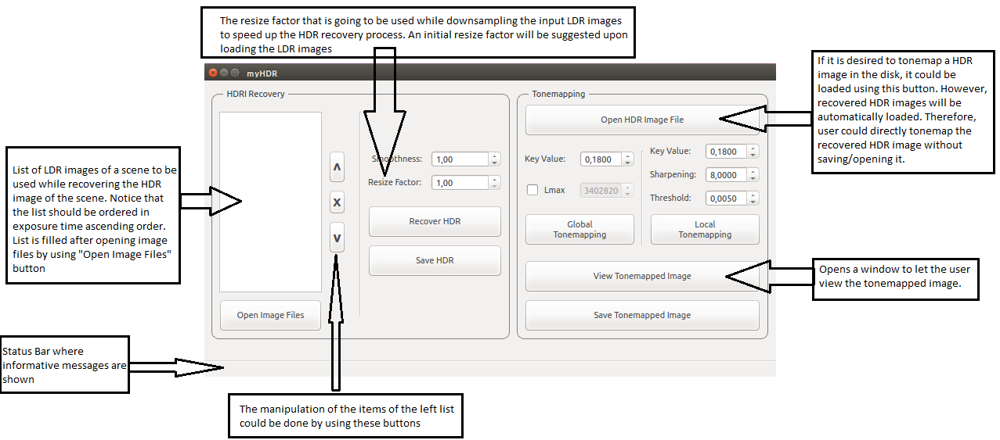

## High Dynamic Range Imaging Project
A term project that was prepared to cover multiple operations related to high dynamic range imaging in a user interface.

The related course is [CENG587 High Dynamic Range Imaging](http://user.ceng.metu.edu.tr/~akyuz/teaching.html), which was offered by [Assoc.Prof. Ahmet Oguz Akyuz](user.ceng.metu.edu.tr/~akyuz) at [CENG](http://ceng.metu.edu.tr) [METU](http://www.metu.edu.tr).

The project includes the implementation of following papers:
* [Recovering High Dynamic Range Radiance Maps from Photographs](http://www.pauldebevec.com/Research/HDR/debevec-siggraph97.pdf) by  Debevec, P. and Malik, J.
* Photographic Tone Reproduction for Digital Images by Reinhard et al.

Also,
* For the user interface, the framework [Qt](https://www.qt.io/) was used.
* For the ease of computations on image matrices, the computer vision library [OpenCV](https://opencv.org/) was used.

To build and run, refer to [readme.txt](Info/README.txt). 

## User interface

